= LİNUX AĞ YÖNETİMİ FİNAL PROJESİ =

*Ad, Soyad :* Nurdan VAYNİ 

*Öğrenci Numarası :* 160202044

== Windows Subsystem for Linux (WSL)

Geliştirme ortamı olarak Linux işletim sisteminin Windows'ta kullanılması.

PowerShell yönetici olarak başlatıldı,

----
Enable-WindowsOptionalFeature -Online -FeatureName Microsoft-Windows-Subsystem-Linux
----
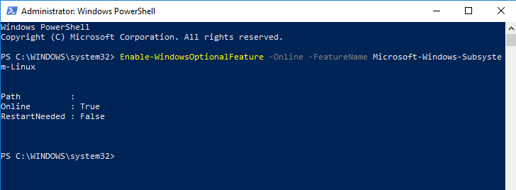

== Ubuntu İndirme

Microsoft Store kullanarak, Ubuntu 20 indirdim.

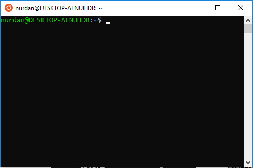

== Virtual Box

Resmi siteden Virtual Box son sürümünü indirdim.

Daha sonra aynı sayfadan VirtualBox Extension Pack(VirtualBox Genişleme Paketi,bütün platformlarda çalışması için) indirdim.

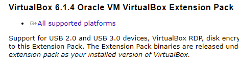

== Virtual Box Kurulum Adımları

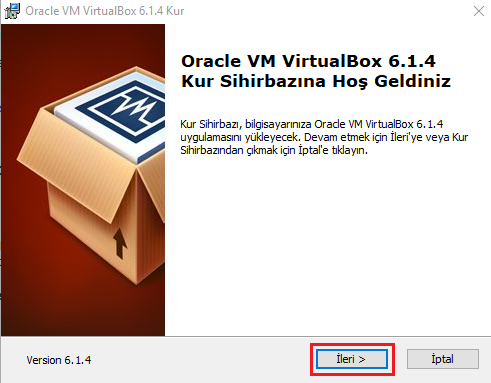
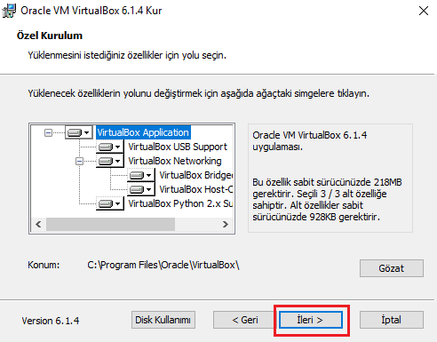
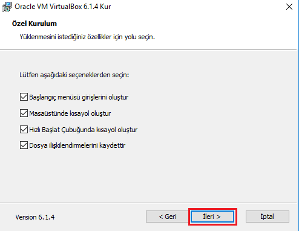
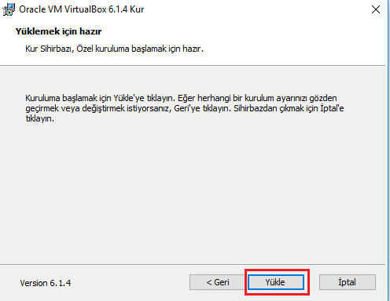
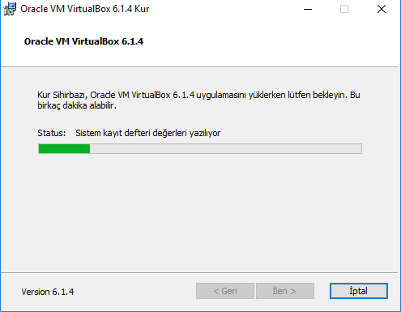
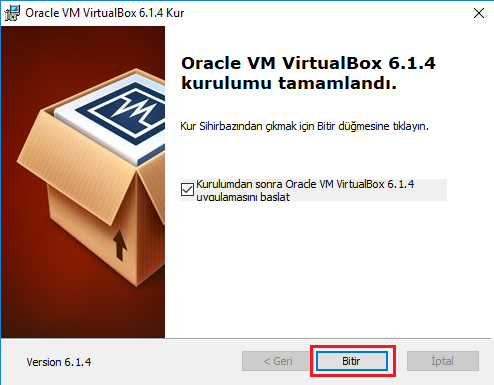
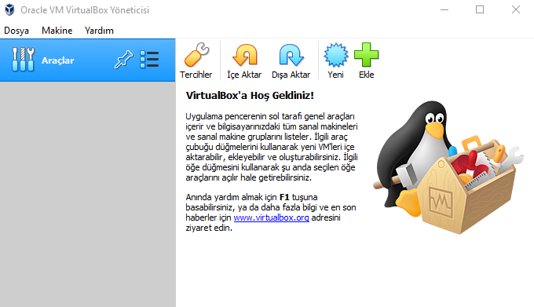

Extension'ın yüklü olup olmadığını kontrol ettim.

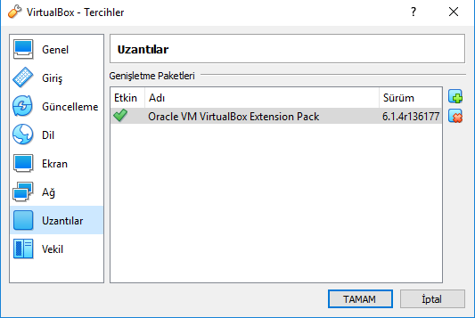

Right Control :

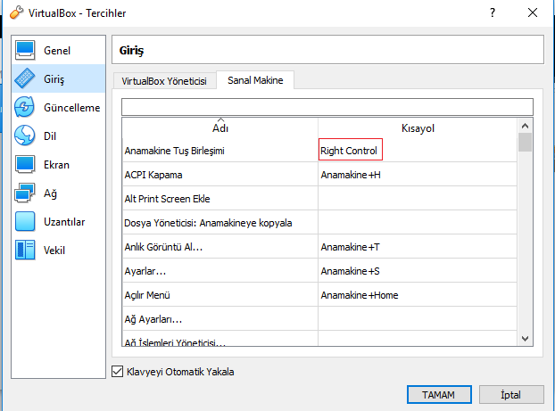

== ------ 

-*Virtualbox üzerinde Ubuntu Desktop 20 kurulumu yapıldı.*

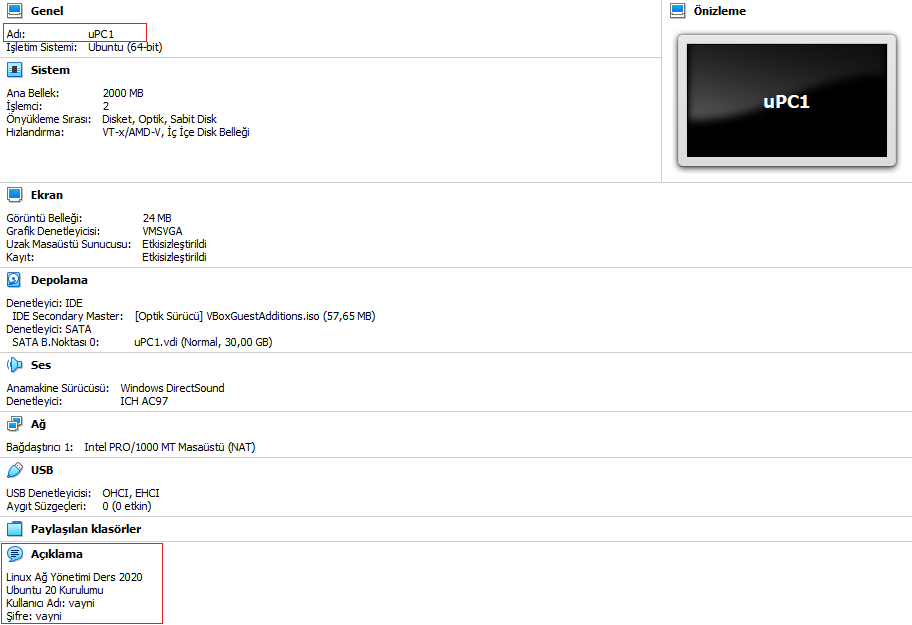

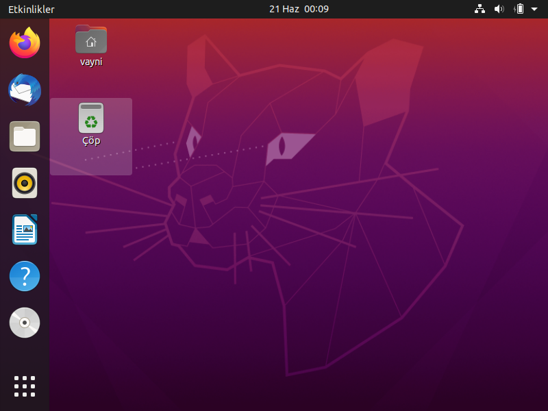

-*Virtualbox üzerinde Core Plus kurulumu yapıldı.*

Tiny core linux bu oldukça hızlı dağıtımı yapan ram, çalıştırmak için tasarlanmıştır.Minimum bir linux dağıtımı projesini hedefliyor.Olabilecek en düşük seviyedeki kurulumlarla bir cihazı çalıştıralım istiyor.Tamamen özelleştirilmiş donanımları hedef alınmış.Örneğin; evdeki bir modem gibi.
Core Plus, tiny core versiyonundan birisidir.

*Core Plus:* Grafik ortamı ve ötesinde kablo ağı bağlantılarını desteklemek için ve kablosuz bağlantılar için destek içerir.

-Çekirdek tamamen bellekte çalışır ve çok hızlı açılır.

*The Exit Options:*

-*Shut down backup*, yaptığımız değişiklikler kalıcı olarak bizde durur. Yaptığım değişiklik kalıcı hale gelsin.RAM'de bir dosyada değişiklik yaptım bu dosyaların bi kopyasını bir sabit diske yazar.Okuma yaptıktan sonra onları RAM'de yine gösterir.

-*Reboot ve none* -> Bütün ayarlar kaybolur.Hiçbir değişiklik kayıt altına alınmıyor.RAM'deki her şey uçuyor.

-*Minimum System Requirements =* Minimum sistem gereksinimlerine bakmak gerekir.

-En az *256 MB RAM* kullanılması gerekir, aksi halde grafik arabirim açılmayacaktır.

-*Sabitlenmiş boyut* , daha hızlı olsun diye sabitlenmiş boyut seçiyorum.

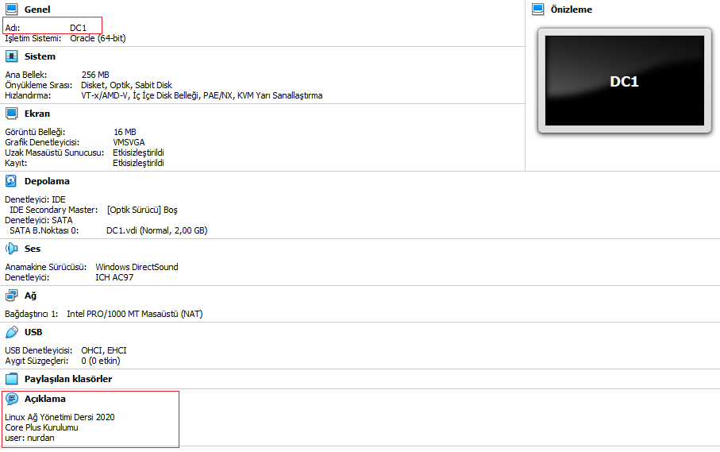

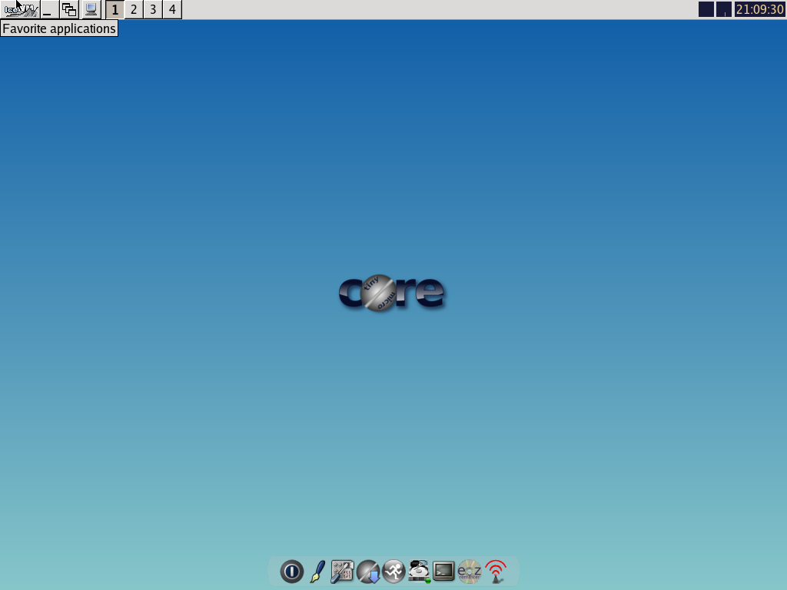

-*Virtualbox üzerinde Ubuntu 20 Server kurulumu yapıldı.*

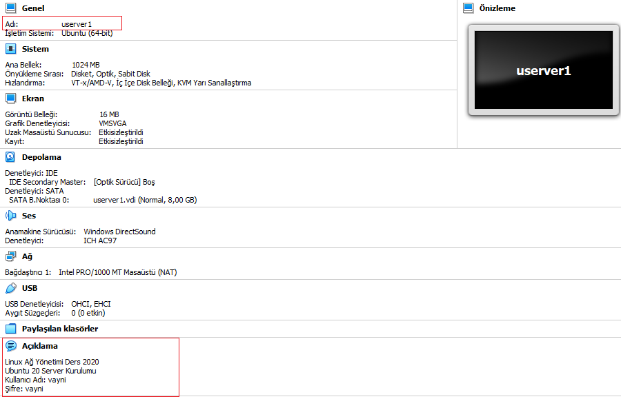

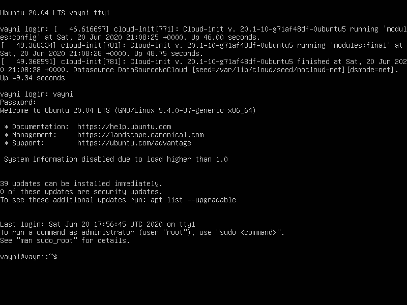

== Klonlama-Çoğalt

Bir sanal makineyi Clone işlemi ile çoğaltarak zamandan tasarruf edebiliriz.

*Tüm ağ bağdaşlaştırıcıları için yeni MAC adresleri oluştur.*

Çünkü eğer MAC adresleri aynı kalırsa ağ üzerinde iki ayrı bilgisayar gibi gözükmez, aynı bilgisayar gibi gözükür ve de çalışmaz.

*Disk adlarını tut.*

*Donanım UUID'lerini tut.*

Birebir clone yapmış oluyoruz.

*Birbirine bağlantılı çoğaltma*

Yeni bir sanal makine oluşturulacaktır ama sanal sabit disk dosyaları orjinal makinenin sanal sabit disk dosyalarına bağlanacaktır ve yeni sanal makineyi farklı bir bilgisayara orjinalinde taşımadan taşıyamayacaksınız.

uPC1,DC1,userver1 -> Her birinden 2 tane clone üretildi.
uPC2,uPC3,DC2,DC3,userver2,userver3 olarak adlandırıldı.

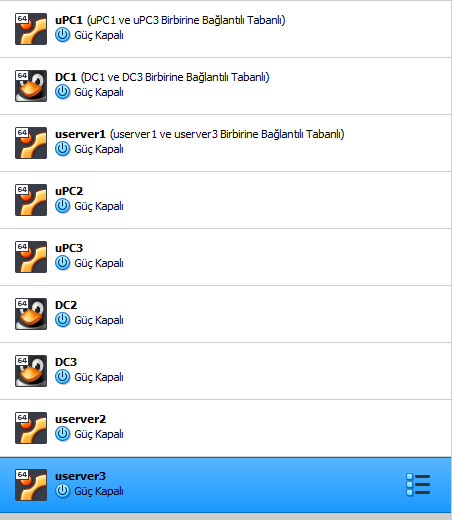

== 1.SENARYO :

- *Ubuntu Desktop için Ağ bağdaştırıcı ayarlarını NAT olarak ayarlayıp HOST (Kullandığınız) bilgisayardan SSH bağlantısı yapabildiğinizi (PORT yönlendirme ayarlarını yaptıktan sonra), ping yapamadığınızı gösterin.*

*NAT:*

-Sanal cihazımız internete çıkabiliyor.Program yükleyebiliyor.

-Otomatik ip atanır.

-Sanal cihazlar kendi aralarında haberleşebilir.

-Sanal makinedeki hizmete erişemiyor.

Bilgisayarın ıp adresi nedir?
[source,]
----
ip -c a
----

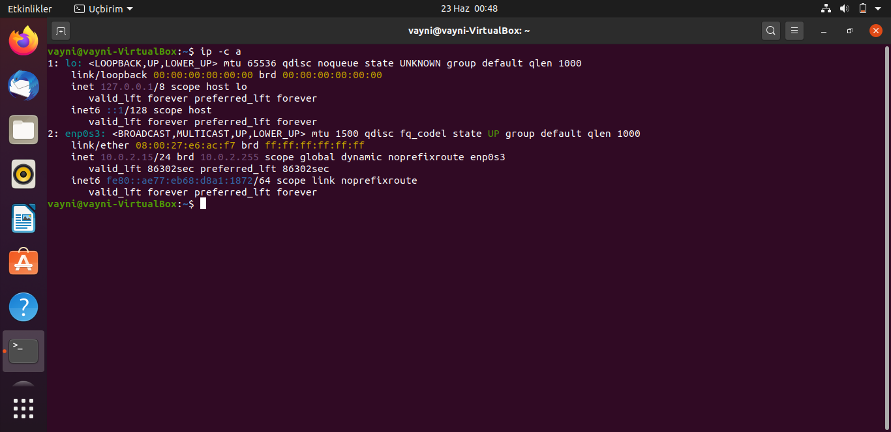

SSH Nedir?

- Güvenli olarak bağlanmasını sağlıyor.Şifrelenmiş olarak gönderiliyor.

Nasıl Yüklerim?
 
[source,]
----
sudo apt-get install ssh
----

paketleri yüklemem gerekiyor.

[source,]
----
ncurses-term openssh-server openssh-sftp-server ssh-import-id
----

ve arka plan daemon başlatılması lazım.

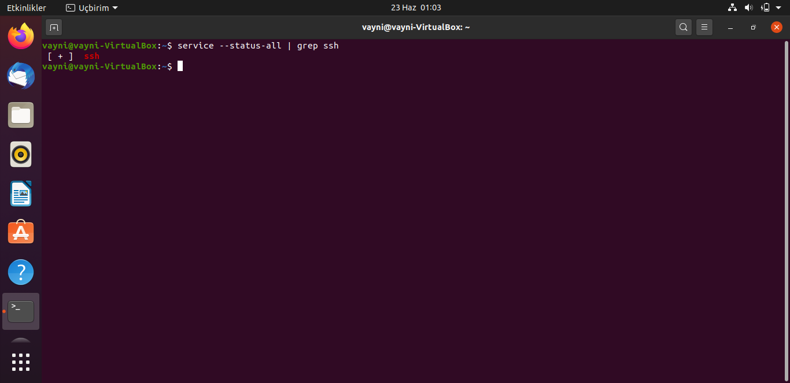

Port yönlendirme ayarları yapıldı:

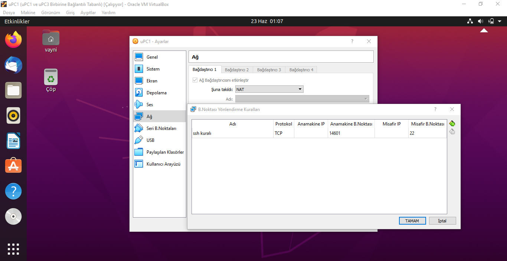

Host bilgisayardan SSH bağlantısı yapıldı:

-p: port numarası

-l: kullanıcı adı

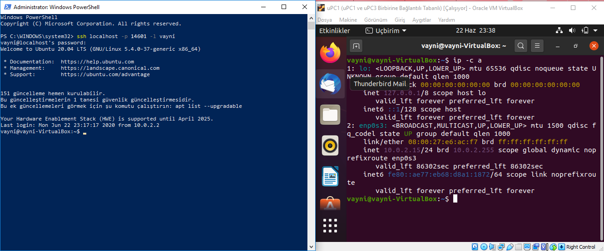

Ping yapılamıyor:

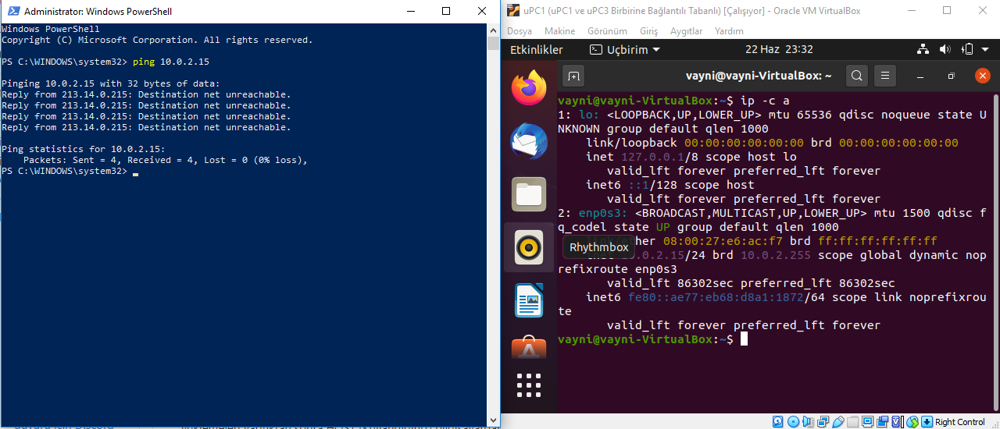

- *HOST bilgisayardaki dosya ismi soyadiniz.txt şeklinde olan bir dosyayı misafir (guest) işletim sistemine Misafir eklentileri yükledikten sonra kopyala yapıştır yaparak gerçekleştiriniz.*

*1.adım:*

Misafir eklentilerini yükle.

[source,]
----
Aygıtlar-> Misafir Eklentileri CD Kalıbını Yerleştir... 
----

Çıkan CD içerisinden Yazılımı Çalıştır'a tıklayıp kuruyoruz.

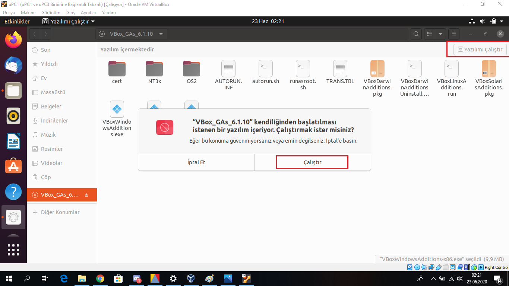

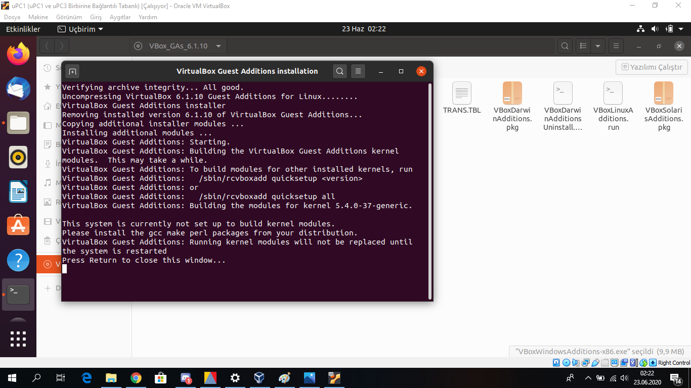

*2.adım:*

[source,]
----
Aygıtlar -> Paylaşılan Pano -> Çift Yönlü

Aygıtlar -> Sürükle Bırak -> Çift Yönlü
----

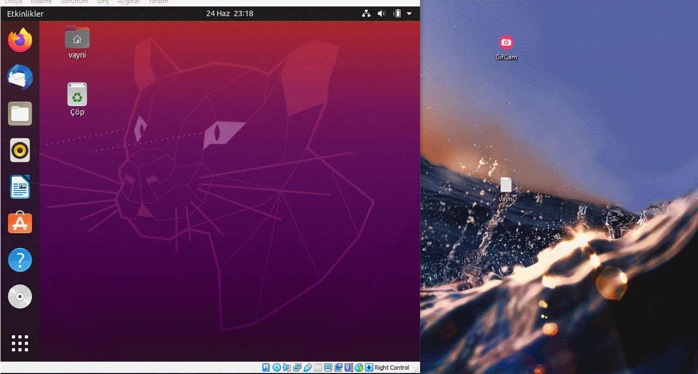

- *Dcore işletim sisteminin ağ bağdaştırıcı ayarlarını Köprü bağdaştırıcı olarak seçtikten sonra DC1 IP adresini bulun. SSH bağlantısı yapabilmeniz için gerekli yüklemeleri yaptıktan sonra HOST (Kullandığınız) bilgisayardan SSH bağlantısı ve ping yapabildiğinizi gösterin.*

*Köprü Bağdaştırıcı(Bridged Network)*

-Donanımı sanallaştırıyoruz.

-İnternete kendi başına çıksın.

-Kendi başına yeni bir IP adresi varmış gibi davranıyor.

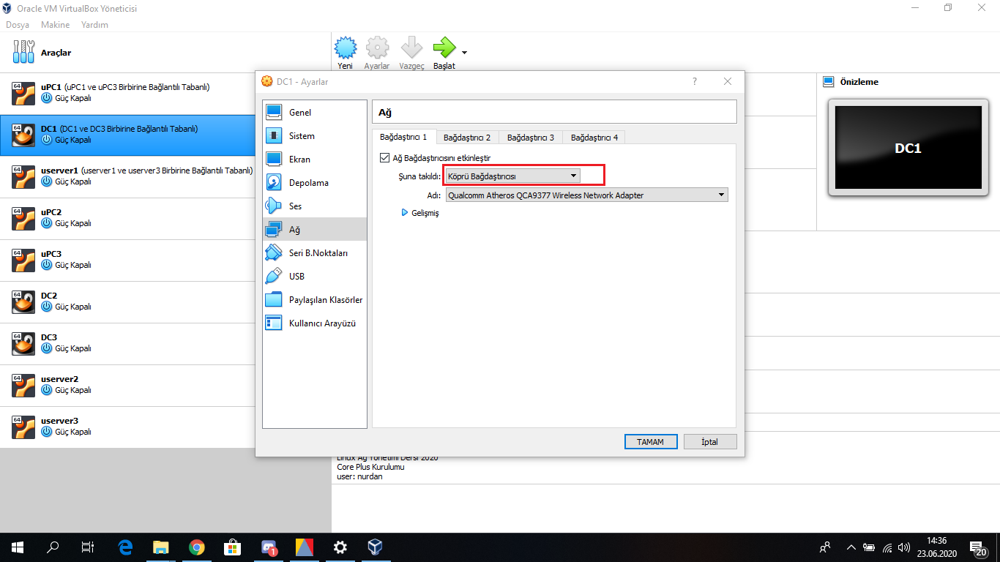

[source,]
----
ifconfig
----

komutu ile IP adresini buluyoruz.

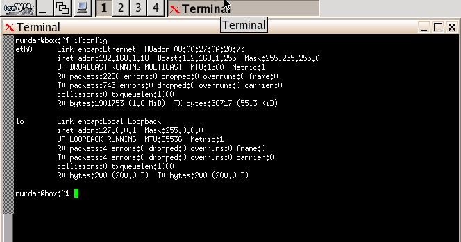

*SSH bağlantısı yapıldı.*

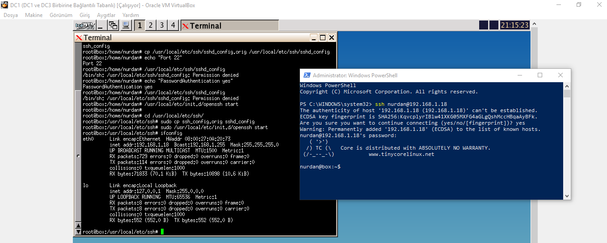

*Ping gönderiliyor.*

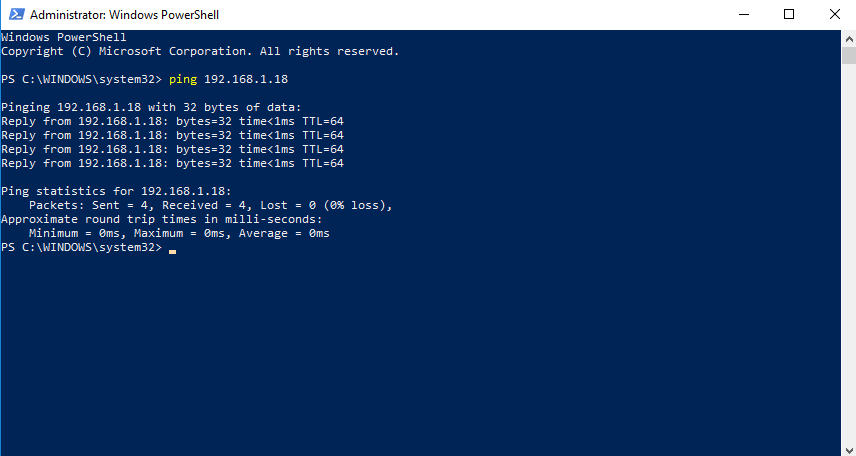

- *Ubuntu Server için yanlnızca anamakine bağdaştırıcısı olarak ayarlama yaptıktan sonra IP adresini bulun. SSH bağlantısı yapabilmeniz için gerekli yüklemeleri yaptıktan sonra HOST (Kullandığınız) bilgisayardan SSH bağlantısı ve ping yapabildiğinizi gösterin.*

*Yalnızca ana makine (Host only network)*

-Sanal cihazlar kendi aralarında haberleşebilirler ve host cihazı ile.

-Dezavantajı, internete çıkamazlar.

*Ubuntu Server için yalnızca Anamakine Bağdaştırıcısı olarak ayarlama yaptıktan sonra IP adresini bulun:*

Kurulumdan sonra Anamakine Bağdaştırıcısı olarak ayarlamadan önceki IP adresi:

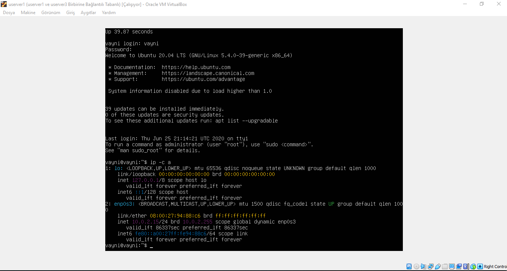

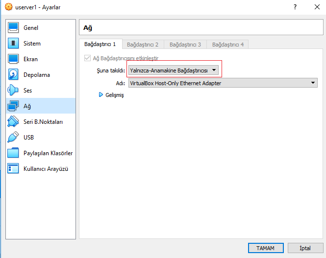

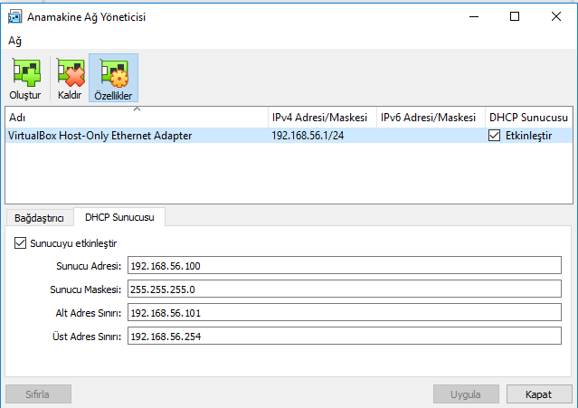

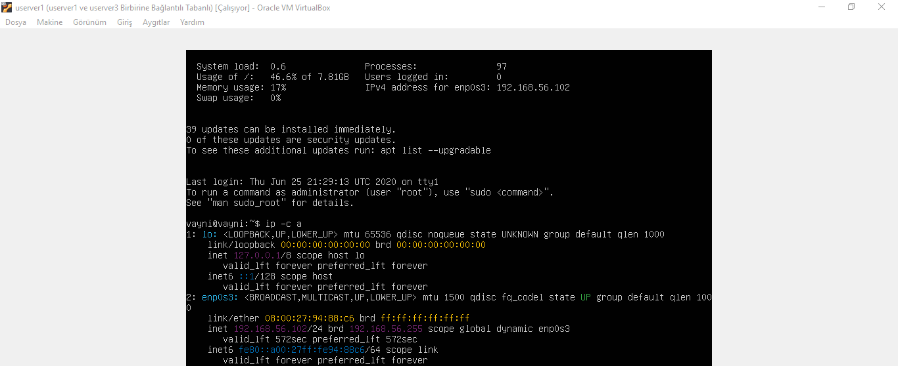

*SSH*

[source,]
----
sudo apt install openssh-server

sudo service ssh start
----

Host bilgisayardan userver1'e SSH ile bağlanıyoruz.

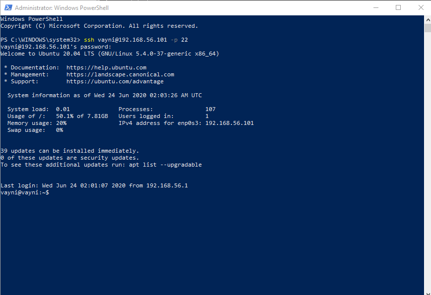

*Ping*

Ping gönderiliyor.

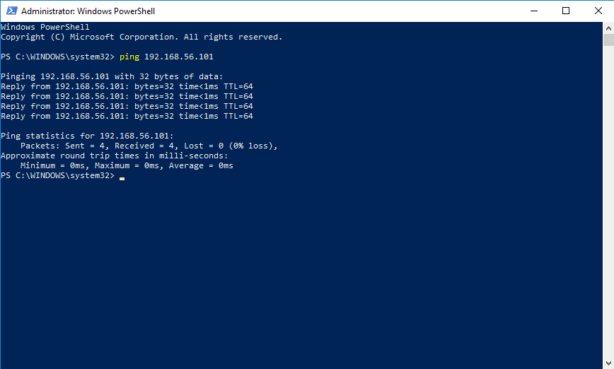

== 2.SENARYO :

- *Numaranızın son iki rakamı S ve R olarak kabul edilmiştir.* 

*userver1, userver2 ve userver3 için ağ bağdaştırıcı ayarlarını dahili ağ olarak ayarlayın. Bilgisayarların IP adreslerini statik olarak aşağıda verilen şekilde ayarlayın :* 

*userver1 : 192.168.R.S*

*userver2 : 192.168.R.S+1*

*userver3 : 192.168.R.S+2*
*Bu üç bilgisayardan birbirilerine ssh yapabildiğinizi ama HOST bilgisayardan bunlara SSH yapamadığınızı gösterin.  ping komutunu kullanarak bu bilgisayarlar arasında haberleşmelerin olduğunu gösterin.*

_1.Adım:_

userver1,userver2 ve userver3 için ağ bağdaştırıcı ayarlarını dahili ağ olarak ayarlıyorum.

*Dahili Ağ(Internal Networking)*

-Host cihazlar sanal bir switch ile birbirine bağlıdırlar.

-DHCP tarafından IP ataması gerçekleşemez.

-Otomatik IP vermediği için,kendimiz elle IP vereceğiz.

-Sanal cihazların internete erişimi yoktur.

-Sanal cihazların host cihaza erişimi yoktur.

-Kullanıcıya büyük serbestlik verilmiştir.

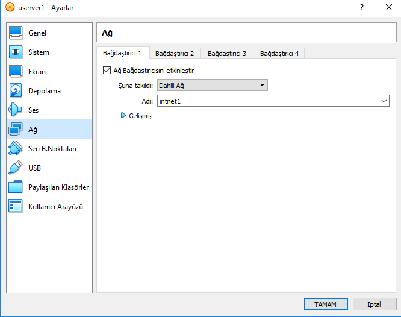

_Netplan:_

-Netplan, Ubuntu'daki ağı yapılandırmak için kullanılan ağ yönetimi aracıdır.YAML sözdiziminde yapılandırma dosyalarını kullanır.

-Netplan ile bir ağ arabirimi yapılandırmak için, bu arabirim için bir YAML açıklaması oluşturmamız gerekir ve netplan gerekli yapılandırma dosyalarını oluşturur.

-Netplan yapılandırma dosyaları /etc/netplan dizininde saklanır ve .yaml uzantısına sahiptir.

YAML yapılandırma dosyasını aşağıdaki komut ile açıyorum.

[source,]
----
sudo nano /etc/netplan/50-cloud-init.yaml
----

-R:4, S:4

[source,]
----
network:
  version: 2
  renderer: networkd
  ethernets:
    enp0s3:
      dhcp4: no
      addresses:
        - 192.168.R.S/24
      gateway4: 192.168.R.1
      nameservers:
          addresses: [8.8.8.8, 1.1.1.1]
----

*userver1 için ayarlanmış yaml dosyası:*

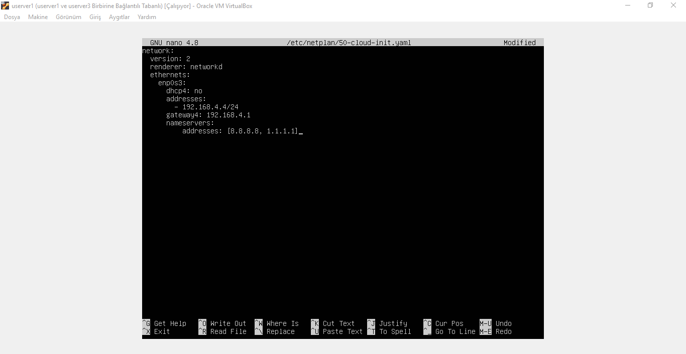

*userver2 için ayarlanmış yaml dosyası:*

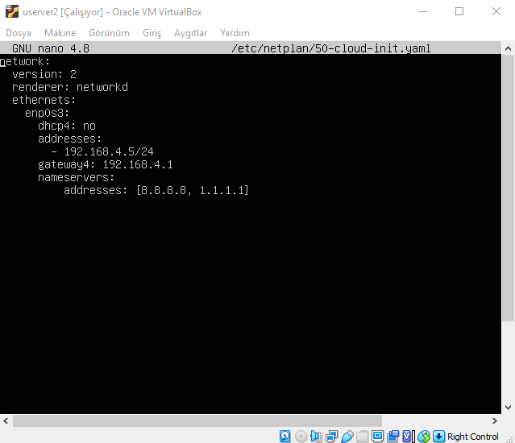

*userver3 için ayarlanmış yaml dosyası:*

-Yaml dosyalasını düzenlerken YAML kod girintisi satırlarına uyduğumdan emin oldum çünkü yapılandırmada sözdizimi hataları varsa, değişiklikler uygulanamaz.

Değişiklikleri aşağıdaki kod satırları ile uyguladım.

[source,]
----
sudo netplan generate

sudo netplan apply
----

*userver1 için statik olarak yapılandırılan IP adresi:*

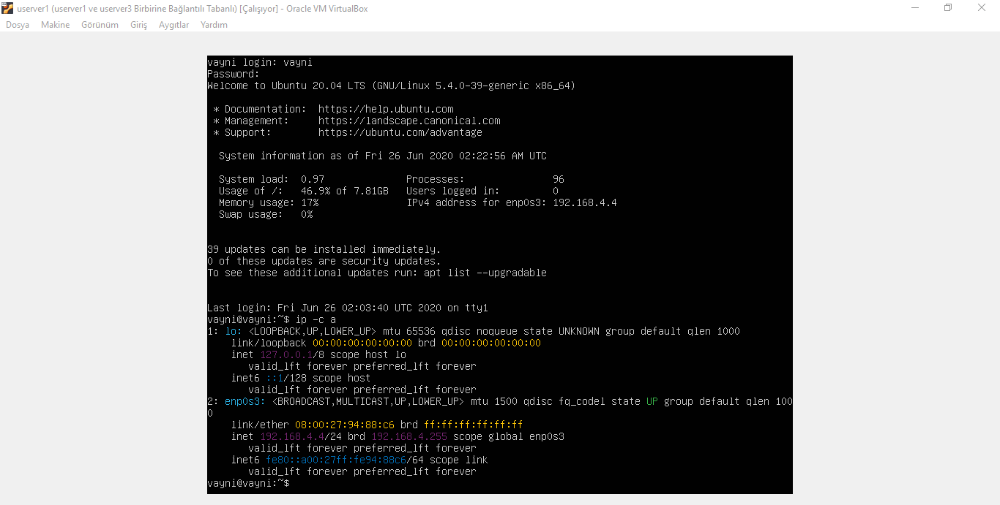

*userver2 için statik olarak yapılandırılan IP adresi:*

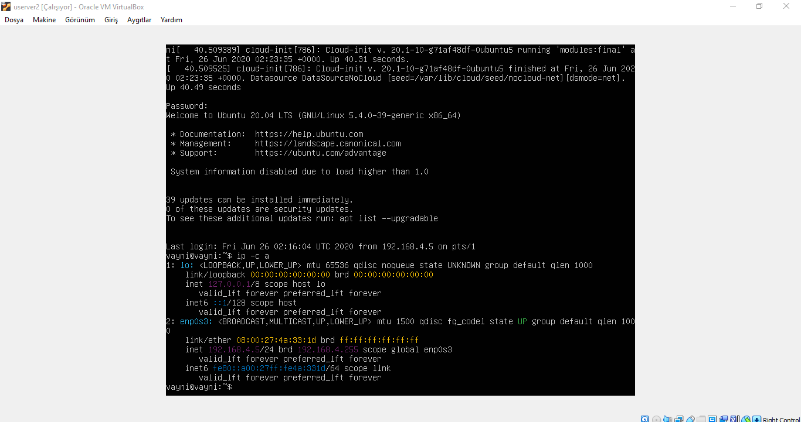

*userver3 için statik olarak yapılandırılan IP adresi:*

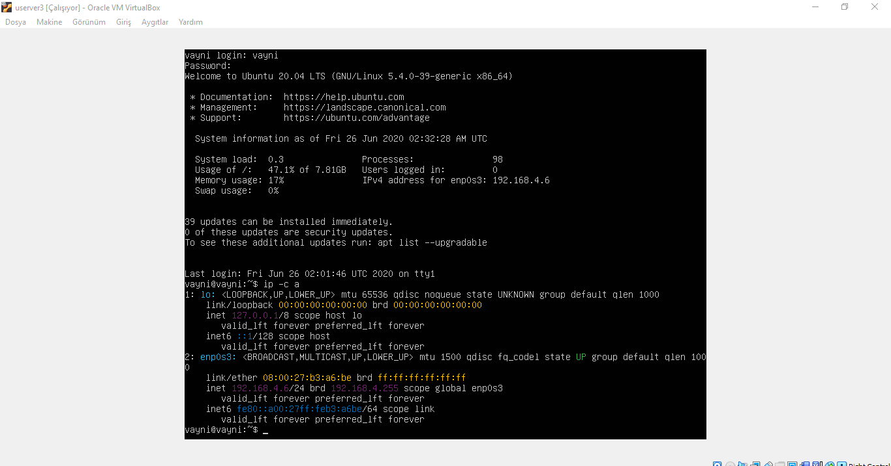

*userver1'den userver2'e ssh bağlantısı*

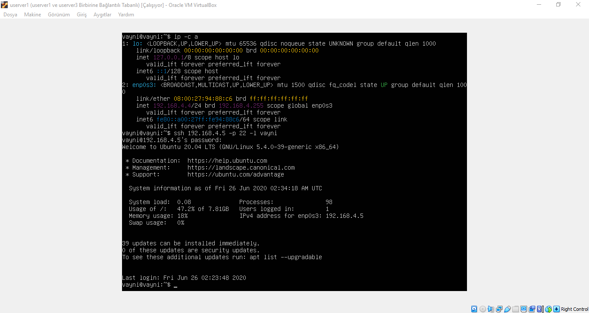

*userver1'den userver2'ye ping*

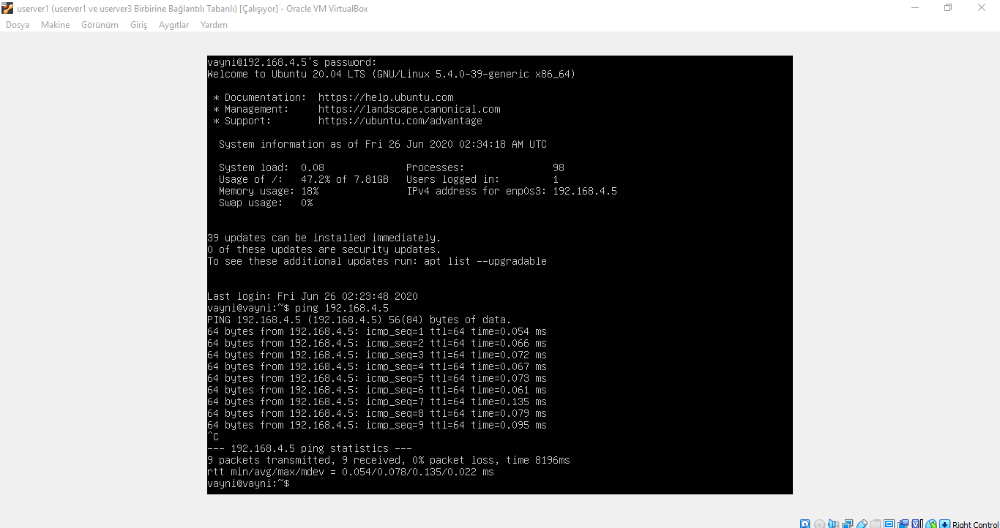

*userver1'den userver3'e ssh bağlantısı*

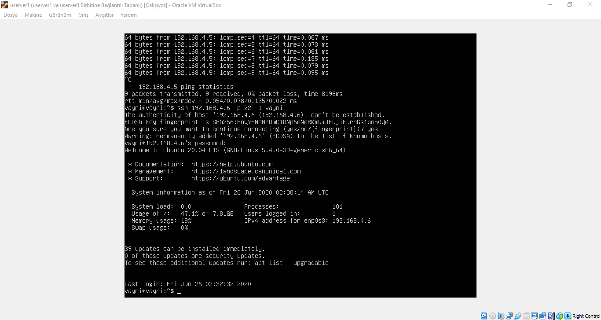

*userver1'den userver3'e ping*

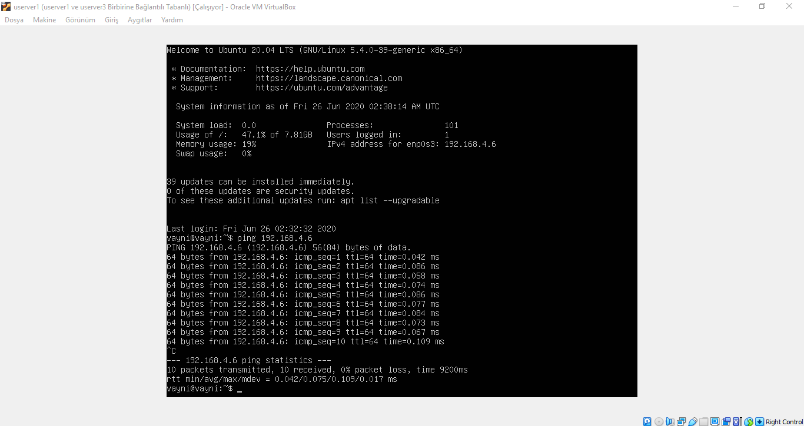

*userver2'den userver1'ye ssh bağlantısı*

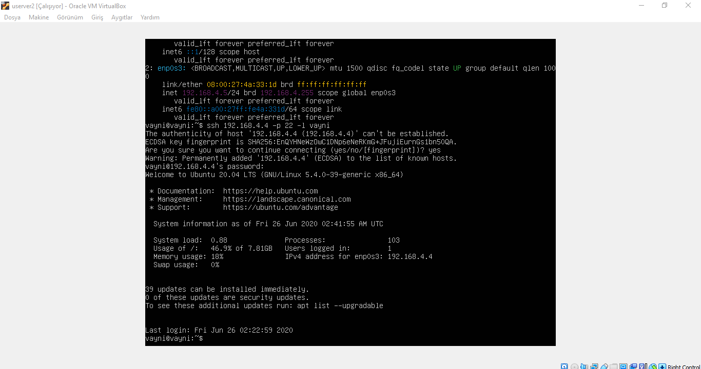

*userver2'den userver1'e ping*

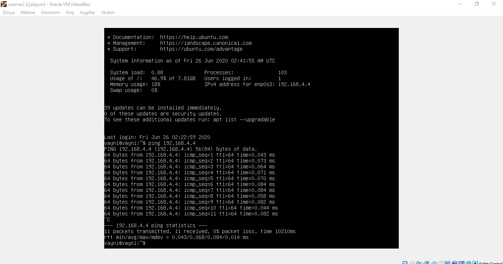

*userver2'den userver3'e ssh bağlantısı*

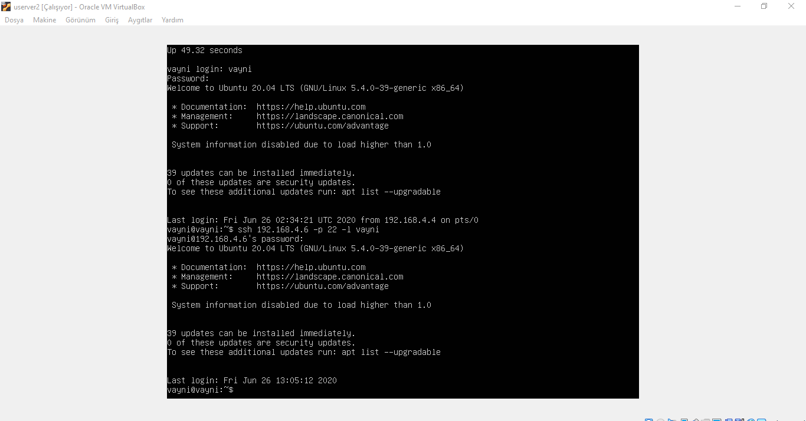

*userver2'den userver3'e ping*


*userver3'den userver1'e ssh bağlantısı*


*userver3'den userver1'e ping*


*Host bilgisayardan userver1, userver2 ve userver3'e SSH bağlantısı yapılamıyor.*


*userver1 bilgisayardaki dosya ismi adiniz.txt, soyadiniz.txt ve numaraniz.txt şeklinde olan bir dosyaları userver2 bilgisayarına gönderiniz. Gönderim işlemi için sFTP veya SCP protokolünü kullanmanız gerekir.*

touch komutu ile 3 tane txt dosyası oluşturdum.

*touch command:* Var olan dosyanın zaman damgasını değiştirir, dosya yoksa yeni bir boş dosya oluşturur.


*SCP (Secure Copy-Güvenli Kopyalama):* SCP komutu ile bir ağdaki iki bilgisayar arasında güvenli dosya transferi yapabiliriz. Bağlantı sırasında SCP aracı SSH kullandığı için dosya transferi şifreli ve güvenlidir.

[source,]
----
scp *.txt 192.168.4.5:/home/vayni/
----

komutu ile scp kullanarak nurdan.txt, vayni.txt, 160202044.txt dosyalarını userver2 bilgisayarına gönderdim.

image::images/74.png

userver2 bilgisayarında ls komutu ile gönderip gönderemediğimi kontrol ettim.


== 3.SENARYO :

- [underline]#*1. Kısım*#

*uPC1 , uPC2 , userver1 ve userver2 için bir ağ bağdaştırıcısını NAT, diğerini dahili ağ olarak ayarlayın.*
*uPC1 ve userver1 dahili ağ ismini dahili1,* 
*uPC2 ve userver2 dahili ağ ismini dahili2 olarak ayarlayın.*
*userver1 ve userver2 için üçüncü bir ağ* *bağdaştırıcısını yine dahili ağ olarak ayarlayın.*
*userver1 dahili ağ ismini dahili2,* 
*userver2 dahili ağ ismini dahili1 olarak ayarlayın.*

- Network isimleri aynı olduğunda, aynı ağa bağlı demek. Farklı olduğunda ise farklı ağlara bağlı demek.

_uPC1 ağ bağdaştırıcı ayarları:_


_uPC2 ağ bağdaştırıcı ayarları:_

_userver1 ağ bağdaştırıcı ayarları:_


_userver2 ağ bağdaştırıcı ayarları:_

[width="100%",options="header"]
|====================
|Node|VirtualBox Interface|VirtualBox Network Type|Name 
|uPC1|Adapter 2|Internal|dahili1  
|uPC2|Adapter 2|Internal|dahili2  
|userver1|Adapter 2|Internal|dahili1  
|userver1|Adapter 3|Internal|dahili3  
|userver2|Adapter 2|Internal|dahili2  
|userver2|Adapter 3|Internal|dahili3  
|====================

*Hostname nasıl değiştirilir?*

*1.* 
[source,]
----
sudo hostnamectl set-hostname newNameHere
----
*2.*
[source,]
----
sudo nano /etc/hosts 
----
dosyasının içinde eski hostname'i silip yenisini yazıyoruz.

*3.*
[source,]
----
sudo reboot
----

*uPC1 için Port Yönlendirmesi*


*uPC1 için Port Yönlendirmesi*


*userver1 için Port Yönlendirmesi*


*userver2 için Port Yönlendirmesi*


*userver1* için statik ip ayarlamamız lazım.
dahili ağlar için;

[source,]
----
sudo nano /etc/netplan/50-cloud.init.yaml
----

komutu ile yaml dosyasının içini düzenliyoruz.

[source,]
----
network:
  version: 2
  renderer: networkd
  ethernets:
    enp0s8:
      dhcp4: no
      addresses:
        - 192.168.1.254/24
      nameservers:
          addresses: [8.8.8.8, 8.8.4.4]
    enp0s9:
      dhcp4: no
      addresses:
        - 192.168.100.1/24
      nameservers:
          addresses: [8.8.8.8, 8.8.4.4]
----


NAT ağ bağdaştırıcı için;

_Kısa bir not:_

NAT neden var, neden kullanıyoruz ? -> Internal Network'de olmayan bir şey için yani,

VM <- Host

VM -> Host

[source,]
----
sudo nano /etc/netplan/00-installer-config.yaml
----

[source,]
----
network:
  version: 2
  renderer: networkd
  ethernets:
    enp0s3: 
     dhcp4: yes
----

şeklinde düzenleyip kaydediyoruz.


sonra,

[source,]
----
sudo netplan generate

sudo netplan apply
----

komutları ile kaydediyoruz ve,

[source,]
----
sudo reboot
----

ip ayarlamaları sonrası,

[source,]
----
ip -c a
----


*userver2* için statik ip ayarlamamız lazım.
dahili ağlar için;


NAT ağ bağdaştırıcı için;


ip ayarlamaları sonrası,


*uPC1* için statik ip ayarları;

[source,]
----
sudo nano /etc/netplan/50-cloud-init.yaml
----

[source,]
----
network:
    ethernets:
        enp0s3:
            dhcp4: yes
        enp0s8:
            dhcp4: false
            addresses:
              - 192.168.1.1/24
            nameservers:
              addresses: [8.8.8.8, 1.1.1.1]
            routes:
            - to: 192.168.0.0/16
              via: 192.168.1.254
    version: 2
----


ip ayarlamaları sonrası,

[source,]
----
sudo netplan generate
sudo netplan --debug apply
----


*uPC2* için statik ip ayarları;

[source,]
----
network:
    ethernets:
        enp0s3:
            dhcp4: yes
        enp0s8:
            dhcp4: false
            addresses:
              - 192.168.2.1/24
            nameservers:
              addresses: [8.8.8.8, 1.1.1.1]
            routes:
            - to: 192.168.0.0/16
              via: 192.168.2.254
    version: 2
----


== userver1 Quagga Yazılımı Yüklemesi

Host makineden userver1'e ssh bağlantısı yapıyoruz.İşlemlerimizi burdan yapmaya devam edicez kopyala yapıştır kullanıp işimizi kolaylaştırmak adına.

[source,]
----
ssh localhost -p 15601
----

_Küçük bir hatırlatma:_

[source,]
----
ssh localhost  -> Bir makinede ssh servisi çalışıyor mu diye kontrol edebiliriz.
----

-p : port numarası

-l : kullanıcı adı


Quagga yazılımını ubuntu servera yüklemeden önce;

*Quagga yazılımı:*

* Bir yönlendirme yazılımıdır.

* Açık kaynak kodludur.

* GNU Zebra projesini geliştirmişler.

* Yaptığı şey; gerçek bir tane yönlendirici satın alsak onun içerisinde bulunan yazılım gibi çalışan bir şey.

Daha sonra yükleme kısmına geçiyorum:

[source,]
----
sudo su   -> root oluyoruz.
apt-get update
apt install quagga 
----
[source,]
----
sudo apt install quagga-doc -> install documentation
----
[source,]
----
nano /etc/quagga/daemons -> daemonları yapılandırmak ve düzenlemek için çalıştırıyoruz.
----

dosyanın içerisine,
[source,]
----
zebra=yes
bgpd=no
ospfd=yes
ospf6d=no
ripd=no
ripngd=no
isisd=no
babeld=no
----

satırlarını yazdıktan sonra kaydedip çıkıyoruz.

[source,]
----
cp /usr/share/doc/quagga-core/examples/zebra.conf.sample /etc/quagga/zebra.conf

cp /usr/share/doc/quagga-core/examples/ospfd.conf.sample /etc/quagga/ospfd.conf

chown quagga.quaggavty /etc/quagga/*.conf

chmod 640 /etc/quagga/*.conf
----

*Açıklama*

*cp* komutu: önce kaynak sonra hedef.

zebra.conf.sample dosyasını kopyalıyor aynı zamanda sample'ı da siliyor sonundan.Yani dosyanın adı zebra.conf oluyor.

kaynak -> .sample , hedef -> .conf 

*chown* 

conf dosyasına sahiplik atamak için kullanılıyor.
[source,]
----
chown quagga.quaggavty /etc/quagga/*.conf
----

sahibini aynı zamanda grubunu da değiştiriyor.

*640 ne anlama geliyor*

Dosya izinleri ile ilgili.

6 -> ikilik sayı sisteminde 110 -> okur , yazar , çalıştıramaz. -> quagga kullanıcısı bunu yapabilir.

4 -> grup -> 100 -> sadece okuyabiliyor.

0 -> 000 -> ne okur, ne yazar, ne çalıştırır.

- 777 olunca -> bütün hepsine izin verir.

*Açıklamalardan sonra devam ediyoruz:*

Arka planda zebra çalıştığı için zebra.Burda bir deamon başlatıyorum :

[source,]
----
/etc/init.d/zebra start 
----

Ortam değişkenlerini burda saklıyoruz ortam değişkenlerinin kalıcı olabilmesi için bashrc diye bir dosya düzenlememiz gerekiyor, eğer bashrc dosyasının içine yazmazsak yeni bir terminal açtığımızda bu komut gider. :

[source,]
----
nano /etc/bash.bashrc
----

Dosyasının en sonuna,

[source,]
----
export VTYSH_PAGER=more
----

ekliyoruz ve kaydedip çıkıyoruz.

*export* ortam değişkenini atıyor.

[source,]
----
nano /etc/environment -> Bütün sistem kullanıcıları için değiştirilmiş oluyor, bashrc ise bir kullanıcı için.
----

dosyasının sonuna,

[source,]
----
VTYSH_PAGER=more
----

ekledikten sonra kaydedip çıkıyoruz.
[source,]
----
vtysh
----


Şu anda yönlendirici yazılımının içerisindeyim.

Devamında buradaki komutları yazıyorum:

[source,]
----
configure terminal
router ospf
 network 192.168.4.0/24 area 0
 network 192.168.5.0/24 area 0 
 passive-interface enp0s8    
 exit
interface enp0s8
 ip address 192.168.1.254/24
 exit
interface enp0s9
 ip address 192.168.100.1/24
 exit
exit
ip forward
write
exit
----

[source,]
----
cat /etc/quagga/ospfd.conf 
----
[source,]
----
cat >> /etc/quagga/ospfd.conf << EOF
interface enp0s8
interface enp0s9
interface lo
router ospf
 passive-interface enp0s8
 network 192.168.1.0/24 area 0.0.0.0
 network 192.168.100.0/24 area 0.0.0.0
line vty
EOF
----

komutlarını çalıştırıp yönlendirme ile dosyanın sonuna ekliyoruz.


[source,]
----
cat /etc/quagga/zebra.conf 
----

içinde *ip forwarding* olmadığı için elle zorla ekliyoruz.

[source,]
----
nano /etc/quagga/zebra.conf
----


[source,]
----
reboot 
----

ile baştan başlatıyorum userver1'i.
Hiçbir yönlendirme olmadan userver1 ile uPC1 arasında haberleşebiliyorum.


Gerekli hizmetleri çalıştırıyorum.

[source,]
----
sudo service zebra start
sudo service zebra status
sudo service bgpd start
sudo service bgpd status
----

image::images/115.png[]

Hizmetlerin sistem başlangıcında başlayıp başlamadığını kontrol ediyorum:

[source,]
----
sudo systemctl is-enabled zebra.service
sudo systemctl is-enabled bgpd.service
sudo systemctl enable zebra.service
sudo systemctl enable bgpd.service
----

Sonra, vtysh'a bağlanıyorum:

[source,]
----
sudo vtysh
----


== userver2 Quagga Yazılımı Yüklemesi 

userver1 de olduğunu gibi bunda da ssh bağlantısı yaparak host bilgisayardan devam ediyorum.

[source,]
----
ssh localhost -p 15602 -l vayni
----
[source,]
----
sudo su [source,]-> root oluyoruz.
apt-get update
apt install quagga 
----
[source,]
----
sudo apt install quagga-doc -> install documentation
----
[source,]
----
nano /etc/quagga/daemons -> daemonları yapılandırmak ve düzenlemek için çalıştırıyoruz.
----
dosyanın içerisine,
[source,]
----
zebra=yes
bgpd=no
ospfd=yes
ospf6d=no
ripd=no
ripngd=no
isisd=no
babeld=no
----

satırlarını yazdıktan sonra kaydedip çıkıyoruz.


Daha sonra, aşağıdaki komutları yazıyoruz açıklamalarından userver1 quagga kurulumunda bahsetmiştim.

[source,]
----
cp /usr/share/doc/quagga-core/examples/zebra.conf.sample /etc/quagga/zebra.conf

cp /usr/share/doc/quagga-core/examples/ospfd.conf.sample /etc/quagga/ospfd.conf

chown quagga.quaggavty /etc/quagga/*.conf

chmod 640 /etc/quagga/*.conf
----


[source,]
----
/etc/init.d/zebra start 
----


[source,]
----
nano /etc/bash.bashrc
----

Dosyasının en sonuna,

[source,]
----
export VTYSH_PAGER=more
----

ekliyoruz ve kaydedip çıkıyoruz.


[source,]
----
nano /etc/environment 
----
dosyasının sonuna,

[source,]
----
VTYSH_PAGER=more
----

ekledikten sonra kaydedip çıkıyoruz.

image::images/108.png[]

[source,]
----
vtysh
----


Şu anda yönlendirici yazılımının içerisindeyim.

Devamında buradaki komutları yazıyorum:

[source,]
----
configure terminal
router ospf
 network 192.168.6.0/24 area 0
 network 192.168.5.0/24 area 0 
 passive-interface enp0s8    
 exit
interface enp0s8
 ip address 192.168.2.254/24
 exit
interface enp0s9
 ip address 192.168.100.2/24
 exit
exit
ip forward
write
exit
----

[source,]
----
cat >> /etc/quagga/ospfd.conf << EOF
interface enp0s8
interface enp0s9
interface lo
router ospf
 passive-interface enp0s8
 network 192.168.2.254/24 area 0.0.0.0
 network 192.168.100.2/24 area 0.0.0.0
line vty
EOF
----

image::images/111(1).png[]

[source,]
----
cat /etc/quagga/zebra.conf 
----

içinde *ip forwarding* olmadığı için elle zorla ekliyoruz.

[source,]
----
nano /etc/quagga/zebra.conf
----


[source,]
----
reboot 
----

Gerekli hizmetleri çalıştırıyorum.

[source,]
----
sudo service zebra start
sudo service zebra status
sudo service bgpd start
sudo service bgpd status
----

Hizmetlerin sistem başlangıcında başlayıp başlamadığını kontrol ediyorum:

[source,]
----
sudo systemctl is-enabled zebra.service
sudo systemctl is-enabled bgpd.service
sudo systemctl enable zebra.service
sudo systemctl enable bgpd.service
----

Sonra, vtysh'a bağlanıyorum:

[source,]
----
sudo vtysh
----


*uPC1 üzerinden veri paketlerinin userver1, userver2 ve uPC2 bilgisayarlarına ayrı ayrı nasıl gittiğini gösteriniz. Bunun için uygun bir komut kullanmanızı gerekiyor.*

*traceroute* ne işe yarar?

- traceroute komutu bir sunucuya erişene kadar gidilen yolu tespit etmeye yarar. Bunun için bu yol boyunca uğradığı bütün sunuculara ICMP paketleri gönderir. 

[source,]
----
sudo apt install traceroute
----

*uPC1'den uPC2'ye traceroute*


*uPC1'den userver1'e traceroute*


*uPC1'den userver2'e traceroute*


*Network Yapısı Grafik:*


